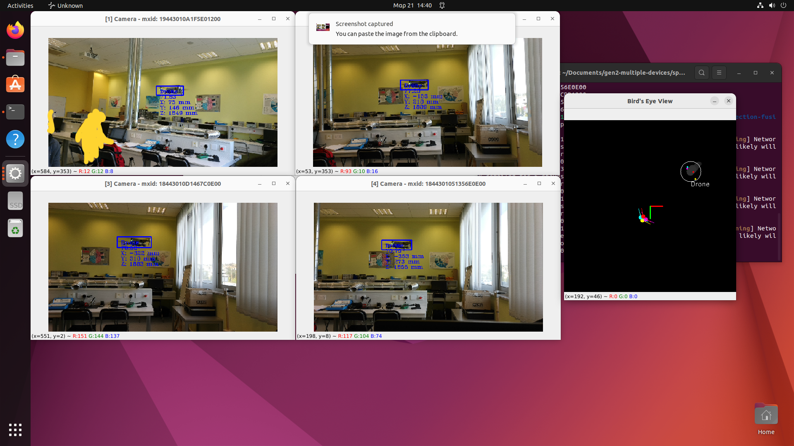
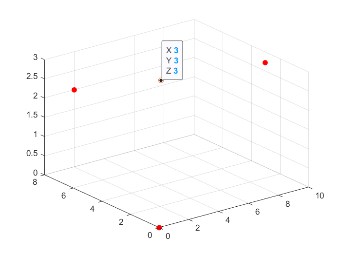
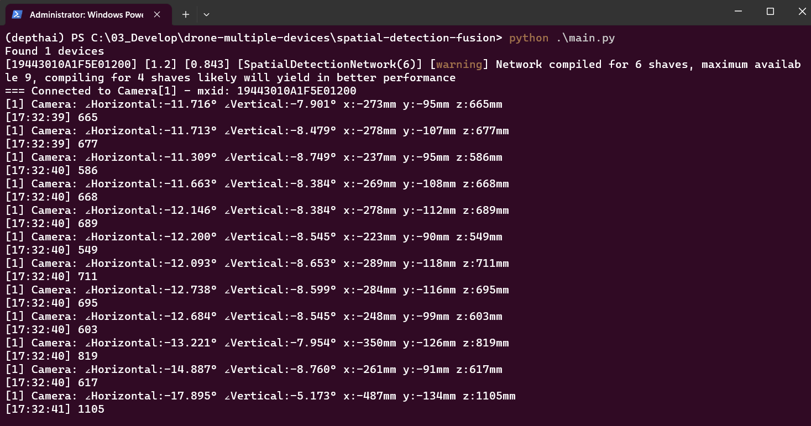

# Drone 3D indoor positioning

---

A YOLOv5 Nano model was trained in this project and it was used for drone detection. The PyTorch file was then converted to blob format using [https://tools.luxonis.com/](https://tools.luxonis.com/) for running on the OAK cameras.

## Demo

---

This example demonstrates multiple Luxonis OAK-D cameras tracking drone in an indoor environment and showing the position in MATLAB.



The position of the drone is inferred in MATLAB to be displayed in a 3D coordinate system as follows:



The values detected from the OAK camera will be displayed on the terminal



| key | action |
| --- | --- |
| q | quit |
| d | toggle depth view |
| b | open bird eye view |

## Setup

```
python3 -m pip -U pip
python3 -m pip install -r requirements.txt
```

## Usage

> Before you can run this demo you need to calibrate the cameras. Go to multi-cam-calibration and generate a calibration file for each camera. Make sure that the calibration_data_dir in the config.py is set correctly.
> 

Run the `main.py` with Python 3.

```
python3 main.py
```

Camera's position will appear in the bird's-eye view along with its detected objects and the detected value will transmit to MATLAB via TCP protocol for analysis the coordination.

## Reference

------

[https://github.com/luxonis/depthai-experiments/tree/master/gen2-multiple-devices](https://github.com/luxonis/depthai-experiments/tree/master/gen2-multiple-devices)